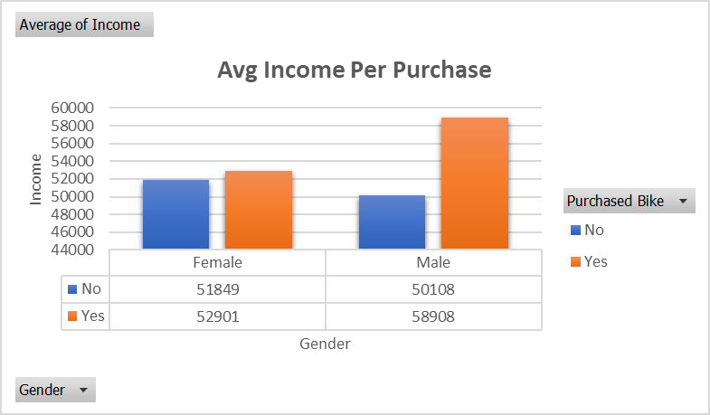
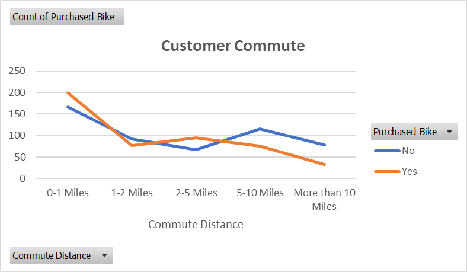
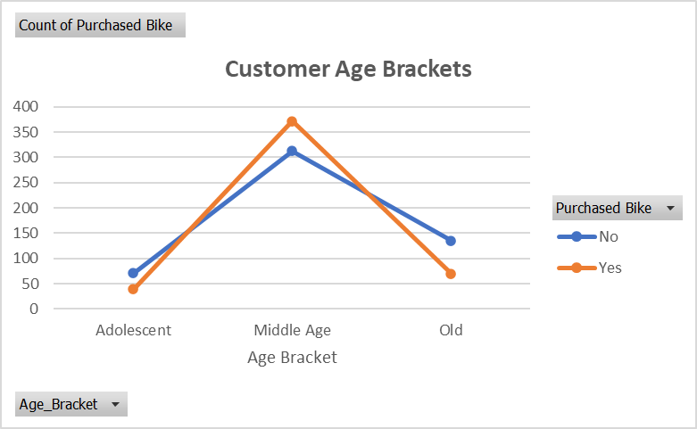

# Bike Buyers Dashboard - Excel Project

This is an Excel project based on the tutorial "Full Project in Excel | Excel Tutorials for Beginners" by 'Alex The Analyst'.

Provided with the bike buyers dataset, I created a Dashboard to gain insights about the bike buyers. These are the steps in our Excel Project:

### Data Cleaning

1. Remove all duplicates

- We used data tool to remove duplicates.
- Outcome: 26 duplicate rows removed
- 1001 unique rows remain

2. Find and Replace
   In the Marital Single Column:

- Replace 'M' with 'Married'
- Replace 'S' with 'Single'

In the Gender Column:

- Replace 'F' with 'Female'
- Replace 'M' with 'Male'

3. Fix the format of Income to currency

4. Add a column to group the age interval
   =if(L2>54,"Old", if(L2>=31,"Middle Age”,if(L2<31,"Adolescent","Invalid")))

### Pivot Tables

We created three pivot tables for data exploration: Average Income Per Perchase, Customer Commute and Customer Age Brackets. Three plots are shown below:

It is observed that customers with a higher income are more likely to purchase a bike. Also, the average income of male customers is higher than that of female customers.

Surprisingly, customers with a shorter commute distance are more likely to purchase a bike. This might be because people with longer commutes tend to prefer other modes of transportation for convenience.

The middle age group (31-54 years old) has the highest number of bike purchases.

### Dashboard

All the graphs are nicely displayed in the dashboard with three slicers for interactive filtering: Marital Status, Region and Education.
